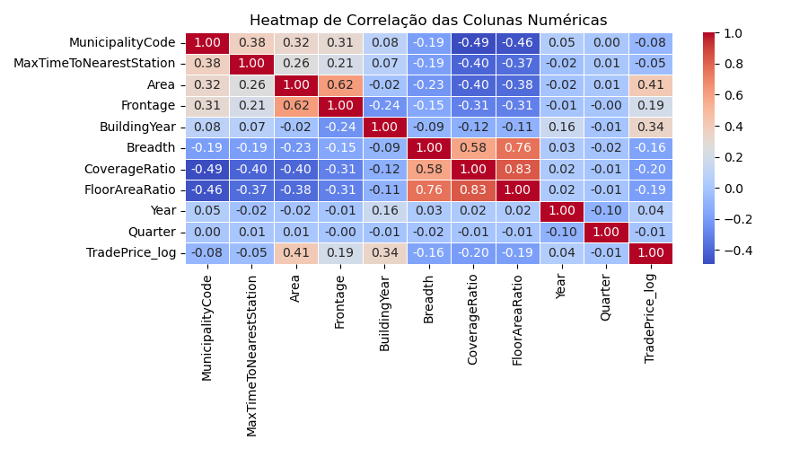

# House Prices Forecasting
A house prices forecasting project with Tokyo data.

# Overview

# Dataset Description
The dataset contains information on real estate transactions in Tokyo from 2005 to 2019, with dozens of columns:

| Column                  | Type     | Description                                         | Example                        |
|-------------------------|----------|-----------------------------------------------------|--------------------------------|
| No                      | INTEGER  | Property ID                                         | 12345                          |
| Type                    | TEXT     | Property type                                       | Residential Land (Land Only)   |
| Region                  | TEXT     | Surrounding area characteristics                    | Commercial Area                |
| MunicipalityCode        | INTEGER  | City code in Japan                                  | 13101                          |
| Prefecture              | TEXT     | Prefecture name in Japan                            | Tokyo                          |
| Municipality            | TEXT     | City                                                | Adachi Ward                    |
| DistrictName            | TEXT     | District                                            | Zushimachi                     |
| NearestStation          | TEXT     | Nearest station name                                | Kobuchi                        |
| TimeToNearestStation    | TEXT     | Time description to the nearest station             | 10-15min                       |
| MinTimeToNearestStation | INTEGER  | Minimum time to nearest station (minutes)           | 10                             |
| MaxTimeToNearestStation | INTEGER  | Maximum time to nearest station (minutes)           | 15                             |
| FloorPlan               | TEXT     | Property floor plan                                 | 2LDK                           |
| Area                    | INTEGER  | Total property area (m²)                            | 220                            |
| AreaIsGreaterFlag       | INTEGER  | Indicates if the area is ≤ 2000 m² (0) or > 2000 m² (1) | 0                              |
| UnitPrice               | REAL     | Price per unit area (Yen per m²)                    | 95000.0                        |
| PricePerTsubo           | REAL     | Price per Tsubo (~3.3 m²) (Yen per Tsubo)           | 320000.0                       |
| LandShape               | TEXT     | Land shape                                          | Semi-rectangular Shaped        |
| Frontage                | REAL     | Frontage area (m²)                                  | 11.5                           |
| FrontageIsGreaterFlag   | BOOL     | Indicates if the frontage area is ≤ 50m² or > 50m²  | False                          |
| TotalFloorArea          | INTEGER  | Total floor area (m²)                               | 10                             |
| TotalFloorAreaIsGreater | INTEGER  | Indicates if the total floor area is ≤ 2000 m² (0) or > 2000 m² (1) | 1                              |
| BuildingYear            | INTEGER  | Building year                                       | 1979                           |
| PrewarBuilding          | INTEGER  | Indicates if built before (0) or after (1) 1945     | 0                              |
| Structure               | TEXT     | Building structure type*                            | LS                             |
| Use                     | TEXT     | Current property use                                | House                          |
| Purpose                 | TEXT     | Future use purpose                                  | Shop                           |
| Direction               | TEXT     | Frontage direction                                  | Northwest                      |
| Classification          | TEXT     | Classification of the front road                    | Prefectural Road               |
| Breadth                 | REAL     | Front road width (m)                                | 3.7                            |
| CityPlanning            | TEXT     | Designated district use by Urban Planning Law       | Urbanization Control Area      |
| CoverageRatio           | INTEGER  | Maximum building coverage ratio (%)                 | 80                             |
| FloorAreaRatio          | INTEGER  | Maximum floor area ratio (%)                        | 300                            |
| Period                  | TEXT     | Transaction period                                  | 2nd quarter 2016               |
| Year                    | INTEGER  | Transaction year                                    | 2016                           |
| Quarter                 | INTEGER  | Transaction quarter                                 | 2                              |
| Renovation              | TEXT     | Renovation?                                         | Not yet                        |
| Remarks                 | TEXT     | Remarks                                             | Dealings including private road|
| TradePrice              | INTEGER  | Property transaction price (Yen)                    | 120000000                      |

*SRC = Steel frame reinforced concrete, RC = Reinforced concrete, S = Steel frame, LS = Light steel structure, B = Concrete block, W = Wooden

# Installation

# Usage

# Preprocessing and Feature Engineering
The dataset presented a series of data issues, making the cleaning and preprocessing stage the longest and most complex part of the project. I'll comment on the main challenges encountered:

**Challenge**: Formatting of raw files
    - **Description:** The provided files were in XLSX format, but their content was actually CSV (comma-separated text). The issue was that there were both legitimate commas and commas used as delimiters.
    - **Solution:** I read the XLSX files into a dataframe, handled the commas with REGEX, and saved the data in CSV and SQL database formats.

**Challenge**: Handling missing values (imputation).
- **Description:** The dataset had a large amount of missing values, with some columns exceeding 50% missing data.
- **Solution:** Implement policies to handle missing values. Columns with more than 50% missing values were removed, while the remaining columns were handled using the MICE method. Why this method? Because it preserves information about feature variability and has a lower computational cost compared to KNN, given this dataset.

**Challenge**: Handling outliers in the target variable.
- **Description:** The TradePrice column had extremely extreme outliers, with values at the 99.5th percentile being more than 10 times larger than those at the 90th percentile. This could hinder model learning.
- **Solution:** I checked the number of occurrences with prices above the 99.5th percentile. Since they were few (less than 5% of the total), I removed these rows.

**Challenge**: Columns with no variance.
- **Description:** Some columns had low variability in values, indicating low informational power.
- **Solution:** To reduce dataset dimensionality, I removed **numeric** columns with variance less than 0.5 standard deviations. 
    - For **categorical** columns, I identified those with fewer unique values and plotted histograms to check the distribution of occurrences. I removed rows with values occurring in less than 2% of the total for the columns 'Region', 'LandShape', 'Direction', 'Classification', and 'CityPlanning'.

At the end of this process, I reduced the original dataset size (df.shape) from (352260, 37) to (275058, 21), resulting in a -22% reduction in rows and a -43% reduction in columns.

# Insights - Exploratory Analysis

**Numerical Columns:**
1. Most properties are inexpensive = the TradePrice distribution has a long right tail (*right skew*). It will be necessary to transform this column (e.g., log transformation) to make it more symmetrical for use in machine learning models.
2. Most properties were built in the early 2000s = they are not old.
3. There is not much variation in frontage (Frontage), area (Area), or width (Breadth) of the properties.
4. Most properties are less than 20 minutes from the nearest station.
5. The year with the most transactions was 2013; the year with the fewest was 2005.
6. Properties are small: the median area is 70m², the median frontage area is 7m², and the median width is 6m.
7. The maximum and minimum time to the nearest station are almost the same = I can remove one of these columns. I will remove the minimum time column.
8. **The metrics with the highest correlation to price are the PROPERTY AREA and its YEAR OF CONSTRUCTION.**

**Categorical Columns:**
1. Most properties are condos.
2. There are almost no occurrences of properties categorized as 'Forest Land' and 'Agricultural Land' = I will remove them.
3. Almost all properties are in residential areas.
4. The majority of properties are southern-facing.
5. Most properties have concrete, wooden, or steel structures.

# Model Selection
Since this is a price prediction problem, I tested the Linear Regression and XGBoost models.

- **Linear Regression:** I like this model because it is simple to apply and explain.
- **XGBoost:** This model is very hard to surpass for tabular data in supervised problems. It has good computational performance and typically ranks among the best in prediction metrics.

For both models, I conducted training through a **pipeline** composed of Pre-Processing and Regression stages.

In the Pre-Processing stage, I used column transformation algorithms:
- **Numeric columns:** StandardScaler to standardize the value scale.
- **'NearestStation' and 'Use':** BinaryEncoder, due to their many categories.
- **'Type', 'Region', 'LandShape', 'Structure', 'Direction', 'Classification', 'CityPlanning':** FrequencyEncoders, as they have fewer categories (but not so few as to justify using OneHotEncoder).

It is important to note that the target variable, 'TradePrice', had already been transformed with logarithms at the end of the exploratory analysis due to its highly skewed distribution.

# Hyperparameter Tuning
The model chosen for optimization was XGBoost due to its significantly superior performance.

The optimization involved defining hyperparameters for a Grid Search. The goal was to optimize the R² metric.

- **Challenge:** The model optimization was taking too much time on my personal computer (an i5 13th generation). I decided to train it on Google Colab's TPUv2 environment, and even then, it took 30 minutes!

# Evaluation Metrics
The chosen performance metrics were MAPE (Mean Absolute Percentage Error), RMSLE (Root Mean Squared Logarithmic Error), and R² (R-Squared).

# Results

| Model               | RMSLE | MAPE  | R²    |
|---------------------|-------|-------|-------|
| Linear Regression  | 0.0304| 0.0232| 0.4240|
| XGBoost             | 0.0174| 0.0110| 0.8250|
| XGBoost Optimized   | 0.0171| 0.0108| 0.8312|

Note that despite the extensive time required to optimize the XGBoost model, the performance gains were minimal.

# Discussion

# Conclusion

# Future Work

# References
- [Handling missing values in dataset — 9 methods that you need to know](https://web.archive.org/web/20240801035444/https://medium.com/@pingsubhak/handling-missing-values-in-dataset-7-methods-that-you-need-to-know-5067d4e32b62)
- [Mean Absolute Percentage Error - Scikit Learn](https://scikit-learn.org/stable/modules/generated/sklearn.metrics.mean_absolute_percentage_error.html)

# Contact
- Tech lead: [João Marcos - Linkedin](https://linkedin.com/in/joaomj)
